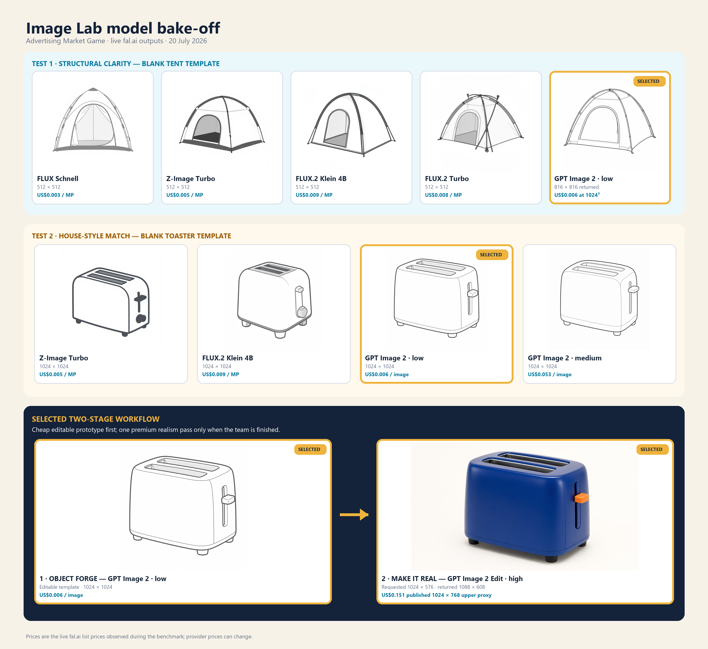

# Image Lab live model benchmark — 20 July 2026

> **Dimension correction — 20 July 2026.** The original 1024×576 GPT Image 2 edit request was below the endpoint's 655,360-pixel floor. Its 1088×608 return was a deterministic rescale, not evidence that fal ignores valid explicit sizes. Production profile `make-it-real-gpt-image-2-high-v2` now requests 1280×720. Live request `019f7eb3-128d-78c1-9cb5-a3c576b5dd0d` returned an exact 1280×720 PNG. The historical calls remain below as evidence of the earlier invalid contract.



## Decision

- **Object Forge:** `openai/gpt-image-2`, low quality, exact 1024×1024 request, one PNG. Stable profile ID: `object-forge-gpt-image-2-low-v1`.
- **Make It Real:** `openai/gpt-image-2/edit`, high quality, one 1024×576 canvas reference, explicit 1280×720 output and one PNG. Stable profile ID: `make-it-real-gpt-image-2-high-v2`.
- **Allowance:** six inexpensive Object Forge attempts and one premium final edit per pair by default.

The cheaper models were fast and serviceable, but GPT Image 2 low was substantially more reliable at believable product geometry, restrained construction lines and large blank surfaces that students can customise. The 1024×1024 medium output was not meaningfully better for this template task despite a roughly ninefold price increase. The high-quality edit preserved the prototype's shape, slots, lever, feet and camera angle while turning it into a convincing product photograph.

No student work, personal data or identifying material was used. These were teacher-operated benchmark prompts against synthetic product templates.

## Endpoint-specific request contracts

Current fal documentation and the live endpoint schema distinguish these payloads:

```json
{
  "prompt": "<server-owned Object Forge prompt>",
  "image_size": { "width": 1024, "height": 1024 },
  "quality": "low",
  "num_images": 1,
  "output_format": "png"
}
```

```json
{
  "prompt": "<server-owned Make It Real prompt>",
  "image_urls": ["<one validated 1024x576 canvas reference>"],
  "image_size": { "width": 1280, "height": 720 },
  "quality": "high",
  "num_images": 1,
  "output_format": "png"
}
```

The custom-size object is intentional: it expresses the requested dimensions directly rather than relying on `landscape_16_9`. The server validates the four documented concrete-size constraints before dispatch and then validates the returned image against the dimensions pinned to the submitted profile. The final image remains fitted into the live canvas by the creator.

Official model pages:

- [GPT Image 2](https://fal.ai/models/openai/gpt-image-2)
- [GPT Image 2 Edit](https://fal.ai/models/openai/gpt-image-2/edit)

## Test 1 — blank tent geometry

All prompts asked for one unbranded, customisable tent template on a clean white background in the catalogue's charcoal-outline illustration style.

| Model | Requested / returned | Live list price | Request ID | Result |
| --- | --- | ---: | --- | --- |
| `fal-ai/flux/schnell` | 512×512 / 512×512 | US$0.003/MP | `019f7e51-b6df-7a41-b41b-93bcdb597d7d` | Recognisable, but the entrance and floor treatment were less editable. |
| `fal-ai/z-image/turbo` | 512×512 / 512×512 | US$0.005/MP | `019f7e51-e0ea-7a71-80e3-618f8d380f24` | Clean silhouette, but heavy dark panels and generic styling. |
| `fal-ai/flux-2/klein/4b` | 512×512 / 512×512 | US$0.009/MP | `019f7e52-1825-7572-b590-ba5bc57f260e` | Structurally usable, but less like the existing catalogue. |
| `fal-ai/flux-2/turbo` | 512×512 / 512×512 | US$0.008/MP | `019f7e52-b49d-7b70-ac8e-64462689f75b` | Rejected: incoherent loose poles crossed the product body. |
| `openai/gpt-image-2` low | small custom request / 816×816 | US$0.006 at 1024×1024 | `019f7e52-3ef3-7d10-9ac2-f27e2aeb72c4` | Best geometry and strongest house-style match. |

## Test 2 — blank toaster at 1024×1024

| Model | Quality | Live list price | Request ID | Result |
| --- | --- | ---: | --- | --- |
| `fal-ai/z-image/turbo` | endpoint default | US$0.005/MP | `019f7e55-4940-7c83-a3eb-7a6d3bc78758` | Usable, but the controls became symbol-like and visually heavy. |
| `fal-ai/flux-2/klein/4b` | endpoint default | US$0.009/MP | `019f7e55-6f41-7971-a71c-f7316320ae6a` | Clean, but generic and less faithful to the catalogue stroke language. |
| `openai/gpt-image-2` | low | US$0.006/image | `019f7e55-95b5-7143-942a-296c356d7bcc` | Selected: coherent two-slot toaster with useful blank body panels. |
| `openai/gpt-image-2` | medium | US$0.053/image | `019f7e56-01a2-7411-b1f1-7b6f5eda4f03` | Very similar to low; the extra cost did not improve classroom utility. |

## Test 3 — final realism pass

The selected low-quality toaster template was supplied as the sole reference. The prompt required a realistic cobalt-blue toaster with the same silhouette, two slots, side lever, rounded body, four feet and camera angle, on an unbranded warm-white studio background.

| Edit request | Requested / returned | Request ID | Result |
| --- | --- | --- | --- |
| named `landscape_16_9` preset, high | preset / 1088×608 | `019f7e58-f906-7f70-b91e-913383bf12ca` | Preserved the design and produced a convincing product photograph. |
| exact `{ width: 1024, height: 576 }`, high | 1024×576 / 1088×608 | `019f7e6a-1dfd-73b0-aa2b-4cef06388cc8` | Historical invalid request: fal rescaled it above the pixel floor. |
| exact `{ width: 1280, height: 720 }`, high | 1280×720 / 1280×720 | `019f7eb3-128d-78c1-9cb5-a3c576b5dd0d` | Current contract: valid exact 16:9 request returned exact dimensions. |

The operations budget uses US$0.211 per 1280×720 high-quality edit as a conservative classroom allowance. Provider prices can change and must be refreshed before activation.
